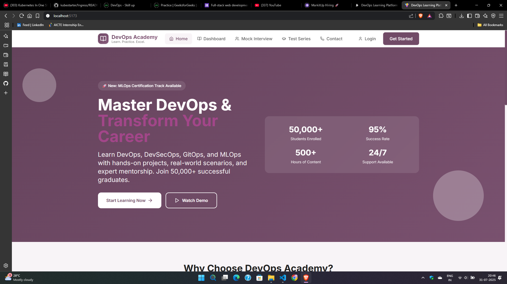
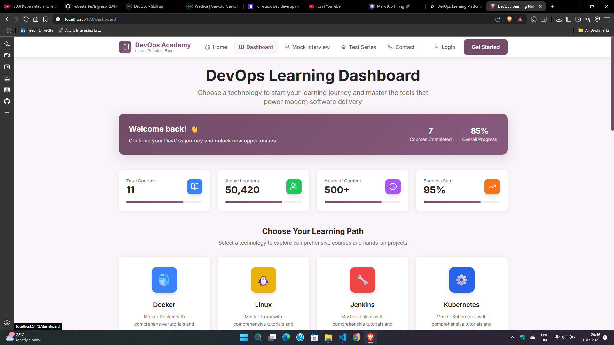
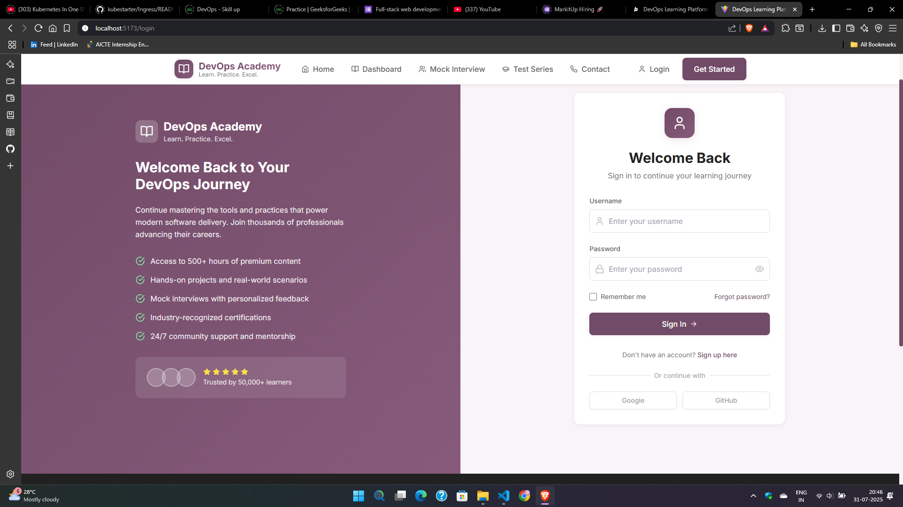
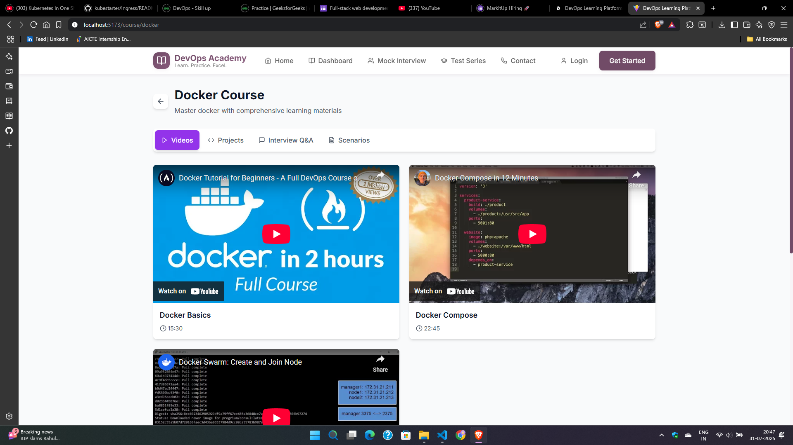
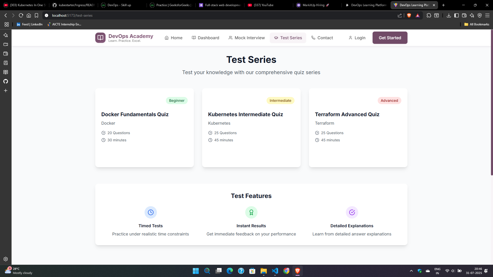
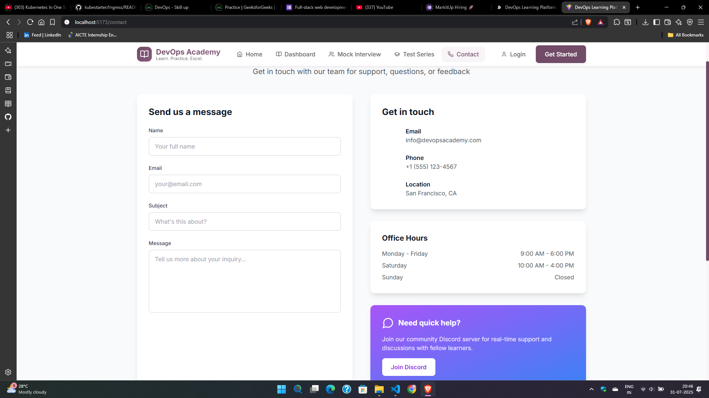
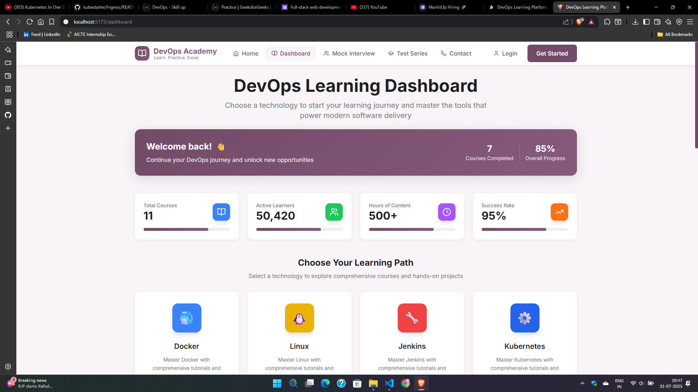
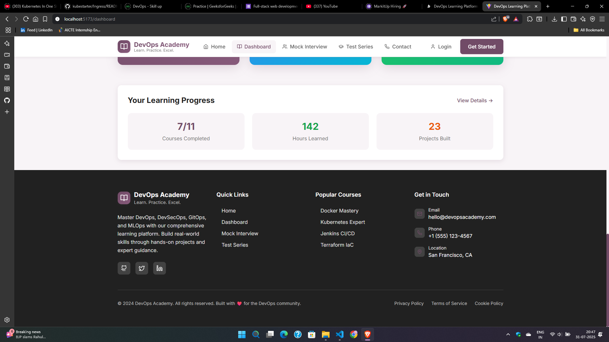

# DevOps Learning Platform
A modern frontend web application for learning DevOps concepts, tools, and practices. This platform provides an interactive learning experience with courses, mock interviews, and assessments.

## 🛠️ Tech Stack

## 📸 Application Screenshots

### Home Page

### Dashboard

### Login Page

### Register Page

### Courses

### Mock Interview

### Test Series

### Contact Page

### Header

### Footer

## ✨ Features

- **Interactive Dashboard** - Track learning progress
- **User Authentication** - Secure login and registration
- **Course Management** - Access DevOps courses
- **Mock Interviews** - Practice interview scenarios
- **Test Series** - Evaluate learning with assessments
- **Responsive Design** - Works on all devices

---

*Frontend-only web application built with modern technologies for DevOps learning.*
